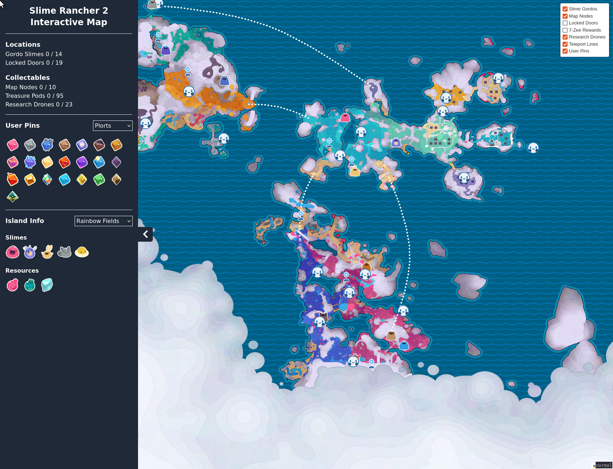

<div align="center">
    <h1 align = "center">Slime Rancher 2 Interactive Map</h1>
</div>

An interactive map for Slime Ranches 2.
The map can be found here: [https://brookjeynes.github.io/slime-rancher-2-interactive-map/](https://brookjeynes.github.io/slime-rancher-2-interactive-map/)



## Copyright disclaimer
All assets used within this project are owned solely by Monomi Park. This project is just for fun and to help the community. No money is being made from this project.

## Running locally
1. Install [Node.js](https://nodejs.org/en/download).
2. [Download](https://github.com/BrookJeynes/slime-rancher-2-interactive-map/archive/refs/heads/main.zip), or clone, this repository.
3. Navigate into the project directory using your terminal.
    ```bash
    cd slime-rancher-2-interactive-map
    ```
4. Install the required packages.
    ```bash
    bun install
    ```
5. Run the web app.
    ```
    bun dev
    ```

## Features
- See locations for:
  - Gordo slimes
  - Bee drones (and the associated logs)
  - Map nodes
  - 7-Zee treasure pods
  - Locked doors
- Place custom icons.
- Mark resources as found.
- Save custom icons and found resources to your browser cache.
- See information about islands such as slimes and resources found.

## Contribution
Contributions, issues, and feature requests are always welcome!
