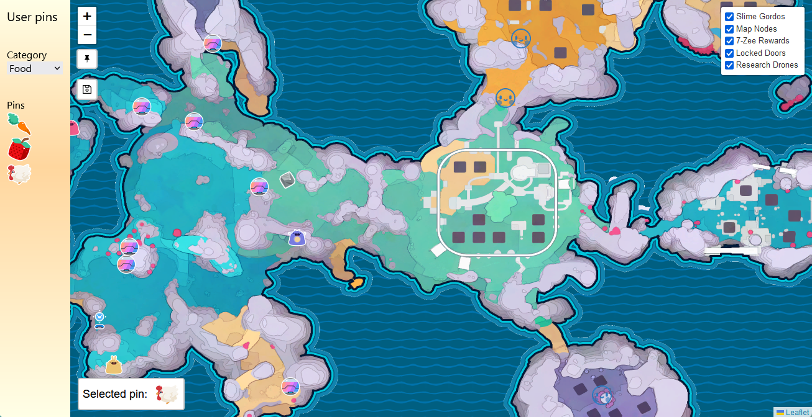

<div align="center">
    <h1 align = "center">Slime Rancher 2 Interactive Map - Written in React</h1>
</div>
<p align="center">
  An interactive map where you can place custom icons and see the locations for Gordo Slimes, Bee Drones, Map Nodes, 7Zee Treasure Pods, and Locked Doors.

  A live version of the website can be found here: https://brookjeynes.github.io/slime-rancher-2-interactive-map/
</p>



## Note
⚠️ All assets used within this project are owned solely by Monomi Park. This project is just for fun and to help the community, no money is being made off this project ⚠️ 

## Usage
1. Navigate into the project directory:
    ```bash
    cd slime-rancher-2-interactive-map
    ```
2. Install the required packages:
    ```bash
    npm install
    ```
3. Run the web app:
    ```
    npm start
    ```
    
## Current features:
- See locations for:
  - Gordo Slimes
  - Bee Drones
  - Map Nodes
  - 7Zee Treasure Pods
- Place custom icons
- Save custom icons to browser

## Planned features:
- All locations for:
  - Bee Drones
  - Locked Doors 
  - Resource Locations 

## Contribution
Feel free to create a pull request and add some new features or clean up the code, any help is appreciated.
